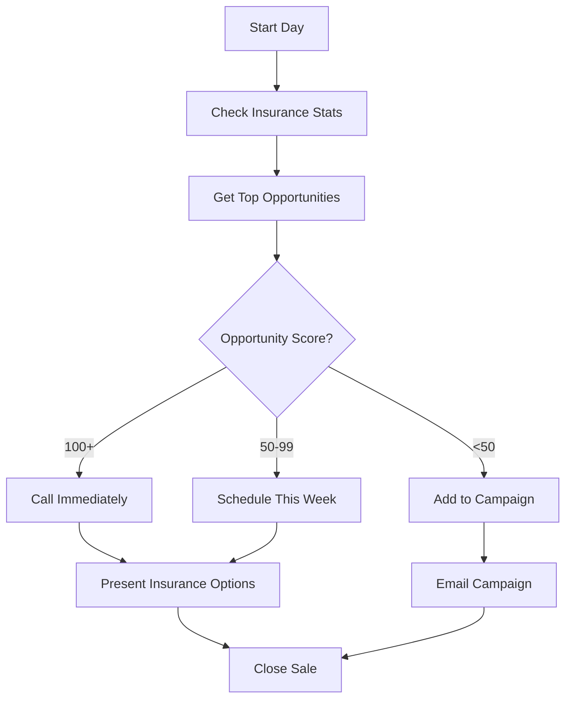

# Insurance Module - Partner Dashboard

## Overview

The insurance module helps advisors identify insurance coverage gaps and cross-sell opportunities within their client base.

## Features

### 1. **Insurance Coverage Gap Analysis**
Identifies clients who are under-insured based on their wealth level and current premium payments.

### 2. **No Insurance Coverage Detection**
Finds high-value mutual fund clients with NO insurance coverage - highest priority opportunities.

### 3. **Insurance Portfolio Analytics**
Provides statistics on insurance coverage by type, premiums, and gaps.

---

## 🚀 Quick Start

### Step 1: Import Insurance Data

```bash
# Make sure PostgreSQL is running
./start_postgres.sh

# Import insurance data
python scripts/import_insurance.py /Users/rishurajsinha/Downloads/query_result_2026-01-30T07_29_27.987956414Z.json
```

Expected output:
```
Creating database tables...
Loading data from ...
Found XXX insurance records to import
Imported 100 records...
...
Import completed!
Total imported: XXX
Total skipped (duplicates): 0
```

### Step 2: Access Insurance APIs

Start the server (if not already running):
```bash
uvicorn app.main:app --reload --host 0.0.0.0 --port 8111
```

Visit: http://localhost:8111/docs

---

## 📊 Insurance Opportunity Types

### 1️⃣ Insurance Coverage Gaps

**What**: Clients paying less premium than expected based on their wealth band

**API**: `GET /api/insurance/opportunities/gaps`

**Parameters**:
- `agent_id` (optional): Filter by agent
- `min_premium_gap` (default: 10000): Minimum gap in rupees
- `min_opportunity_score` (default: 0): Minimum opportunity score (0-100)
- `limit` (default: 100): Max results

**Example**:
```bash
# Get all insurance gaps
curl "http://localhost:8111/api/insurance/opportunities/gaps?limit=10"

# Get high-opportunity gaps (score >= 50)
curl "http://localhost:8111/api/insurance/opportunities/gaps?min_opportunity_score=50&limit=20"

# Filter by agent
curl "http://localhost:8111/api/insurance/opportunities/gaps?agent_id=2116&limit=10"
```

**Response**:
```json
{
  "user_id": "67e905d6-cc60-4d3b-82f2-82f80862173d",
  "name": "ABHEEPSA GUPTA",
  "agent_id": "2129",
  "agent_external_id": "ag_ipB97puHo6gh9PrxmdSri7",
  "opportunity_type": "Insurance Coverage Gap",
  "opportunity_description": "Client has ₹100,000 premium gap. Current coverage: ULIP. Consider adding: Health, Term, Traditional.",
  "wealth_band": "20Cr+",
  "age": 33,
  "mf_current_value": 60357299.13,
  "total_premium": 0,
  "baseline_expected_premium": 100000,
  "premium_gap": 100000,
  "opportunity_score": 133,
  "missing_coverage_types": ["Health", "Term", "Traditional"]
}
```

**Key Fields**:
- `opportunity_score`: Priority score (higher = more urgent)
- `premium_gap`: Potential additional premium
- `missing_coverage_types`: Insurance types client doesn't have
- `wealth_band`: Client wealth segment

---

### 2️⃣ No Insurance Coverage (Cross-Sell)

**What**: High-value MF clients with ZERO insurance coverage

**API**: `GET /api/insurance/opportunities/no-coverage`

**Parameters**:
- `agent_id` (optional): Filter by agent
- `min_mf_value` (default: 1000000): Minimum MF investment
- `limit` (default: 100): Max results

**Example**:
```bash
# Get all clients with no insurance
curl "http://localhost:8111/api/insurance/opportunities/no-coverage?limit=10"

# Get ultra-high-value clients (10Cr+)
curl "http://localhost:8111/api/insurance/opportunities/no-coverage?min_mf_value=10000000&limit=10"
```

**Response**:
```json
{
  "user_id": "user123",
  "name": "Unknown",
  "agent_id": "2116",
  "agent_external_id": "ag_BWPsajWXj4znFUKCUt3Mnh",
  "opportunity_type": "No Insurance Coverage",
  "opportunity_description": "High-value client (₹15,250,000 MF investment) with NO insurance coverage. High-priority cross-sell opportunity.",
  "wealth_band": "5Cr+",
  "age": null,
  "mf_current_value": 15250000,
  "total_premium": 0,
  "baseline_expected_premium": 100000,
  "premium_gap": 100000,
  "opportunity_score": 100,
  "missing_coverage_types": ["Health", "Term", "ULIP", "Traditional"]
}
```

**Why This Matters**:
- These clients have wealth but NO insurance protection
- Highest priority for cross-sell
- Shows trust in company (already invested in MF)
- Opportunity score is always 100 (maximum priority)

---

## 📈 Insurance Statistics

**API**: `GET /api/insurance/stats`

**Example**:
```bash
# Get overall stats
curl "http://localhost:8111/api/insurance/stats"

# Get stats for specific agent
curl "http://localhost:8111/api/insurance/stats?agent_id=2116"
```

**Response**:
```json
{
  "total_policies": 250,
  "total_premium_collected": 5500000,
  "total_premium_gap": 12000000,
  "potential_additional_revenue": 12000000,
  "breakdown_by_type": {
    "Health": {
      "count": 120,
      "total_premium": 2400000
    },
    "Term": {
      "count": 80,
      "total_premium": 2100000
    },
    "ULIP": {
      "count": 30,
      "total_premium": 800000
    },
    "Traditional": {
      "count": 20,
      "total_premium": 200000
    }
  }
}
```

---

## 🎯 Client Insurance Details

**API**: `GET /api/clients/{user_id}/insurance`

Get all insurance policies for a specific client:

```bash
curl "http://localhost:8111/api/clients/67e905d6-cc60-4d3b-82f2-82f80862173d/insurance"
```

---

## 💡 Use Cases

### Use Case 1: Morning Insurance Review

```bash
# Step 1: Get top insurance opportunities
curl "http://localhost:8111/api/insurance/opportunities/gaps?min_opportunity_score=80&limit=20"

# Step 2: Get stats overview
curl "http://localhost:8111/api/insurance/stats"

# Step 3: Prioritize calls
# - opportunity_score > 100: Ultra-high priority
# - opportunity_score 50-100: High priority
# - opportunity_score < 50: Medium priority
```

### Use Case 2: Cross-Sell Campaign

```bash
# Find high-value clients with no insurance
curl "http://localhost:8111/api/insurance/opportunities/no-coverage?min_mf_value=5000000&limit=50"

# These clients are perfect for:
# - Term insurance (life coverage)
# - Health insurance (medical coverage)
# - ULIP (investment + insurance)
```

### Use Case 3: Coverage Analysis

```bash
# Get client's current insurance
curl "http://localhost:8111/api/clients/{user_id}/insurance"

# Check missing_coverage_types field
# Recommend appropriate products:
# - No Term insurance? → Offer term life insurance
# - No Health? → Offer health insurance policy
# - Only basic coverage? → Suggest higher sum assured
```

### Use Case 4: Agent Performance

```bash
# Get agent's insurance stats
curl "http://localhost:8111/api/insurance/stats?agent_id=2116"

# Get agent's opportunities
curl "http://localhost:8111/api/insurance/opportunities/gaps?agent_id=2116"
```

---

## 🎓 Understanding Opportunity Scoring

The `opportunity_score` is pre-calculated in the data based on:
- Client wealth (higher wealth = higher score)
- Premium gap (larger gap = higher score)
- Age (certain ages have higher insurance needs)
- Current coverage (less coverage = higher score)

**Score Ranges**:
- **100+**: Ultra-high priority (wealthy clients, large gaps)
- **50-99**: High priority (good wealth, significant gaps)
- **25-49**: Medium priority (moderate opportunities)
- **0-24**: Lower priority (smaller opportunities)

---

## 📊 Insurance Types Explained

| Type | Description | Typical Use Case |
|------|-------------|------------------|
| **Health** | Medical insurance | Hospital expenses, surgeries |
| **Term** | Pure life insurance | Income replacement for family |
| **ULIP** | Unit Linked Insurance Plan | Investment + insurance combo |
| **Traditional** | Traditional life insurance | Long-term savings + insurance |
| **Twowheeler** | Vehicle insurance | Two-wheeler coverage |

---

## 🎯 Wealth Band Mapping

| Band | MF Value | Expected Annual Premium |
|------|----------|------------------------|
| **20Cr+** | ≥ ₹20 Crore | ₹100,000 |
| **5Cr-20Cr** | ₹5-20 Crore | ₹50,000 |
| **1Cr-5Cr** | ₹1-5 Crore | ₹25,000 |

The `baseline_expected_premium` is calculated based on wealth band.  
The `premium_gap` = baseline_expected_premium - total_premium.

---

## 🔗 Integration with SIP Module

Combine both modules for complete client picture:

```bash
# Get client's SIPs
curl "http://localhost:8111/api/clients/{user_id}/sips"

# Get client's insurance
curl "http://localhost:8111/api/clients/{user_id}/insurance"

# Find high-value SIP clients with no insurance
curl "http://localhost:8111/api/insurance/opportunities/no-coverage"
```

**Powerful Insight**: Clients investing regularly in SIPs but with no insurance are prime candidates for insurance products.

---

## 📝 Sample Workflow



---

## 🚨 Common Scenarios

### Scenario 1: ULIP but no Term Insurance
```json
{
  "missing_coverage_types": ["Term", "Health"],
  "current_coverage": "ULIP"
}
```
**Action**: Recommend term insurance for pure life cover (lower cost, higher coverage)

### Scenario 2: No Coverage at All
```json
{
  "missing_coverage_types": ["Health", "Term", "ULIP", "Traditional"],
  "total_premium": 0
}
```
**Action**: Start with term + health insurance combo

### Scenario 3: Large Premium Gap
```json
{
  "premium_gap": 75000,
  "wealth_band": "20Cr+"
}
```
**Action**: Suggest increasing sum assured or adding riders

---

## 🎉 Success Metrics

Track these KPIs:
- **Conversion Rate**: % of opportunities closed
- **Premium Increase**: Average premium per closed opportunity
- **Cross-Sell Success**: % of MF clients who bought insurance
- **Agent Performance**: Opportunities converted per agent

---

## 🔧 Troubleshooting

### No Data Returned
```bash
# Check if data was imported
docker exec -it wealthy_postgres psql -U postgres -d wealthy_dashboard \
  -c "SELECT COUNT(*) FROM insurance_records;"
```

### Import Errors
```bash
# Check table exists
docker exec -it wealthy_postgres psql -U postgres -d wealthy_dashboard -c "\dt"

# Re-import
python scripts/import_insurance.py /path/to/insurance.json
```

---

## 📚 Next Steps

1. ✅ Import insurance data
2. ✅ Test APIs with Postman or curl
3. ✅ Review top opportunities
4. ✅ Create client outreach plan
5. ✅ Track conversions

For detailed API documentation, visit: http://localhost:8111/docs

---

**Built for Wealthy Platform** | Version 2.0.0
